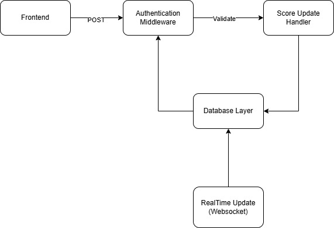

# API Service Specification: Scoreboard Update
## Overview
This software module handles the updating and management of user scores on a website's scoreboard, ensuring real-time updates, secure score changes, and the prevention of unauthorized or malicious score increases.

## Components
### 1. API Endpoint
- Endpoint: POST /api/scores/update
- Description: This endpoint receives a score update request after a user completes an action. The score increase will be validated and applied to the database.
- Request Body:
```
{
  "user_id": "string",
  "score_increase": "number"
}
```
- Response:
    - Success (200): The score was successfully updated.
    - Error (400): Invalid request, such as missing or invalid user_id, or score increase is not a positive number.
    - Error (403): Unauthorized attempt to update the score.
    - Error (500): Internal server error during score update.


### 2. Authentication Middleware
- Purpose: To prevent unauthorized users from updating scores. The middleware will check if the user is authenticated and authorized to perform the score update.
- Authentication Mechanism: Use a token-based system, such as JWT (JSON Web Tokens), sent in the request headers.
- Header Format: Authorization: Bearer <token>
The server will decode the token, verify its validity, and ensure the user is authorized to modify the score.

### 3. Score Update Handler
- Responsibilities:
  - Validate that the user exists in the database.
  - Ensure that the score_increase is a positive integer.
  - Apply the score increase to the user's current score in the database.
  - Update the leaderboard to ensure the top 10 scores are recalculated as needed.
- Business Logic:
  - Score Calculation: When a user completes an action, their score will be incremented by the value in score_increase.
  - Leaderboards Update: The top 10 users’ scores will be recalculated whenever a new score update occurs. The system will ensure that this operation is efficient.

### 4. Database Layer
- Schema:
  - users table:
    ```
    id: Unique user identifier
    score: Current score of the user
    ```
  - leaderboard table:
    ```
    user_id: Foreign key to the users table
    rank: Ranking based on the score
    score: Current score for the user
    ```
- Update Operation:
  - The score will be updated using a transactional process to ensure data integrity.
  - The database will need to store only the latest top 10 users in a separate table or in-memory structure for quick retrieval.

### 5. Real-time Update System
- Technology: WebSockets will be used for real-time updates to the front-end.

## Flow of execution


- The frontend sends a POST request to the /api/scores/update endpoint with the user's ID and score increase.
- The authentication middleware verifies the user's identity and authorization.
- The score update handler processes the request, validates the input, and updates the user’s score in the database.
- The leaderboard is updated, ensuring the top 10 scores are accurate.
- The backend broadcasts the updated leaderboard to all connected clients in real-time.
- The frontend updates the scoreboard display in real-time.